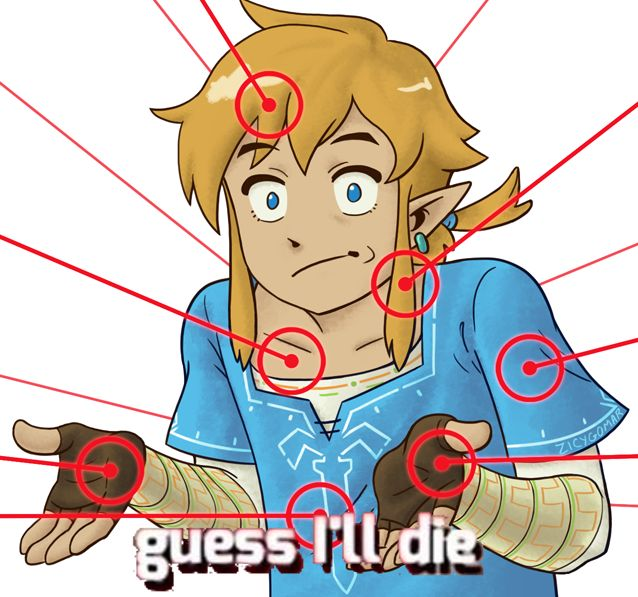

  

<h3 align="center">Link</h3>

  
  
  
  

---

 A general Discord bot.
      

## Table of Contents

- [About](#about)
- [Getting Started](#getting_started)
- [Authors](#authors)

## About 

Automa is a general discord bot where contains some misc commands, to remind about something and event notify a new video from youtube. It deployed on raspberry pi 4 and it's written in C# with the latest .NET release.

## Getting Started 

These instructions will get you a copy of the project up and running on your local machine for development and testing purposes. See [deployment](#deployment) for notes on how to deploy the project on a live system.

### Prerequisites

Make sure you have installed the latest [.NET SDK](https://dotnet.microsoft.com/download/dotnet/5.0).

### Installing

*Work in progress*

## Authors 

* Alexandre Beauchamp &#8212; main developer (<abeauchamp@pulsewave.dev>)
